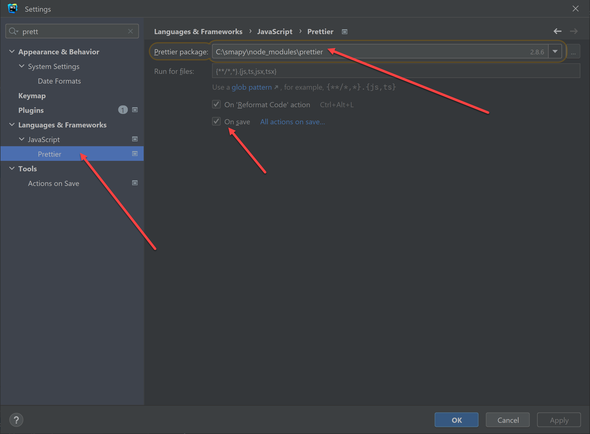

# smapy
___

## New Development Setup

Make sure to get .env file and save in ./app 

```
yarn install
cd app
yarn dev
yarn storybook 
```

We use prettier for code formatting, please configure your IDE 
to reformat on save

Prettier is installed as part of the project so can just use from node_module



## Form Library

We use custom lib based on https://react-hook-form.com/
and modified https://github.com/iway1/react-ts-form

More docs to come...

## Misc

run `python update_he.py` to modify hebrew text.

cd ./app
yarn add file:C:/smapy/storybook-react-i18next-main