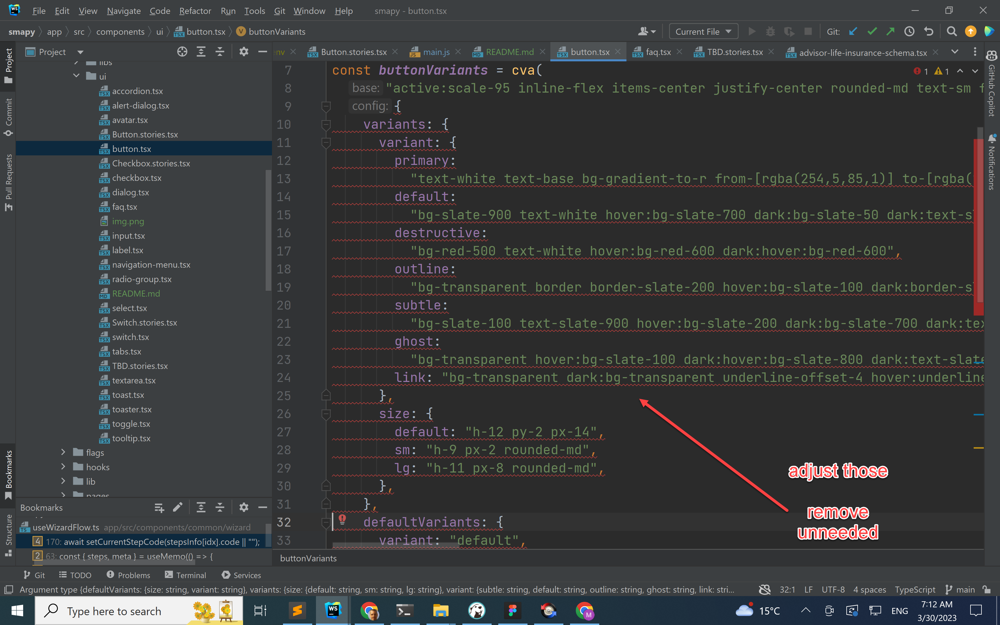

# Design System Component Lib

Those components are copy & Paste from 

https://ui.shadcn.com/

Which use https://www.radix-ui.com/

If we need more components we can take from 

https://preline.co/index.html

Check storybook under /ui 

TODO:

Style base components

Button

