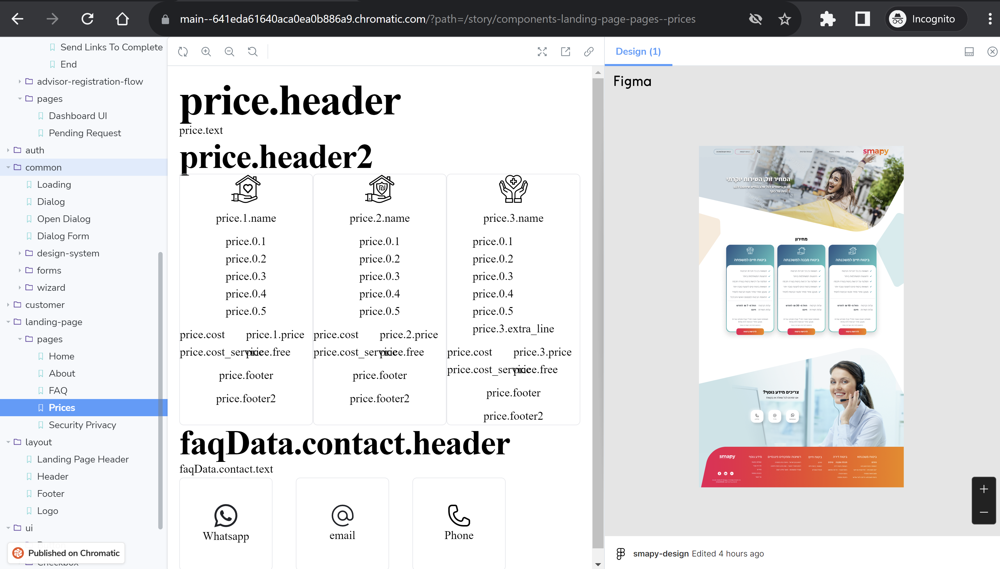
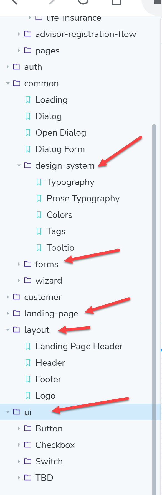

# Apply Figma design to Tailwind/NextJS/React

## General

NextJS/React/Tailwind project

Site content already in place,

We need to apply Tailwind style so the content will match the Figma design

The site includes many forms, they are written in a generic way so there is no need to style each one of them manually
Work is Frontend only, no backend is needed
90% of the work is adding Tailwind style, 10% is minor React or HTML changes
We have a Storybook for all content with links to the correct part of the Figma design

Image: 

## Current Stack

- NextJS
- React
- Tailwind
- Storybook
- TypeScript
- i18next already configured
- Backend: TRPC, Prisma, Supabase (mostly not relevant, this project is mainly UI)
- Github
- Figma

## Scope of work/Notes

- Configure tailwind, fonts, font size, color schema and such
- Apply tailwind classes to the current code to fit Figma design
- Make sure design is responsive, check Figma "Mobile" page for info
- Site is in Hebrew, all code is in English we use i18next for translate (no need to know Hebrew)

## Links

- [Figma](https://www.figma.com/file/sAvmr55UwcNhZNAJ9XGpA6/smapy-design?node-id=601%3A214&t=zhC8Onjn6aOQgPWV-1)
- [Storybook](https://main--641eda61640aca0ea0b886a9.chromatic.com)
- [Github](https://github.com/smapy-com/smapy) send username to allow access
- [Site](https://smapy.netlify.app/he)

## Suggested work order
in Storybook
1 - ui
2 - common/design-system
3 - common/forms
4 - landing-page
5 - layout

The rest

