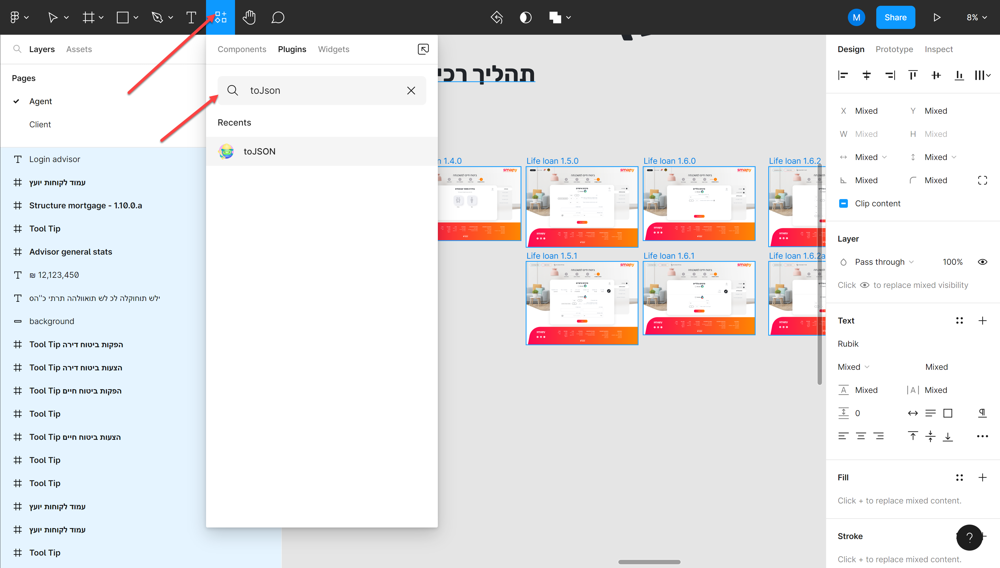
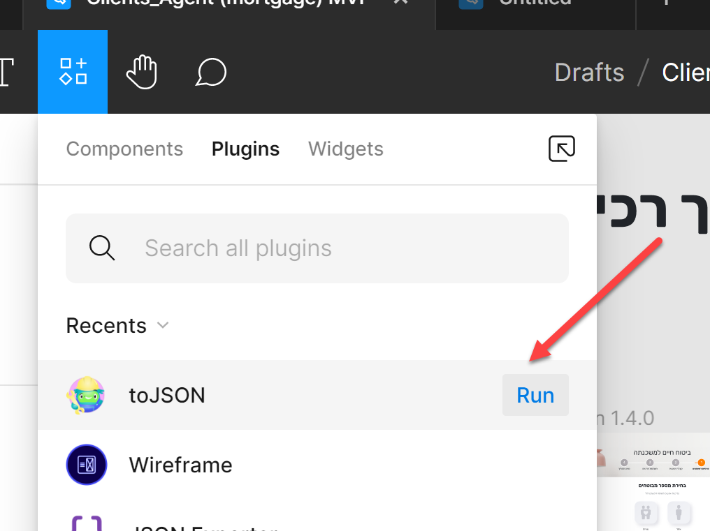
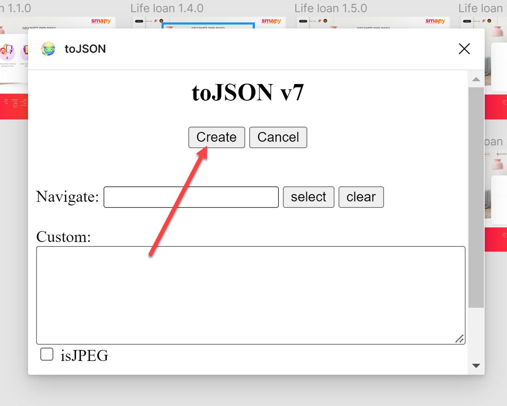
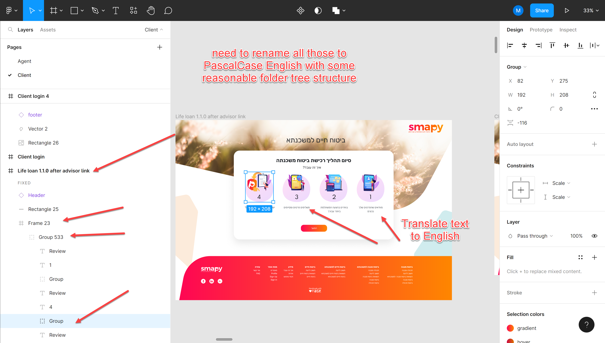
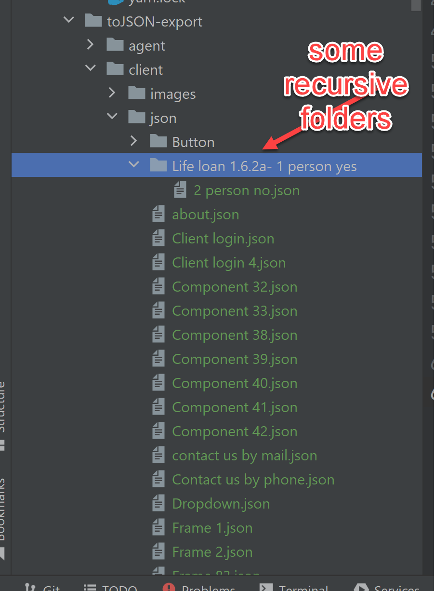
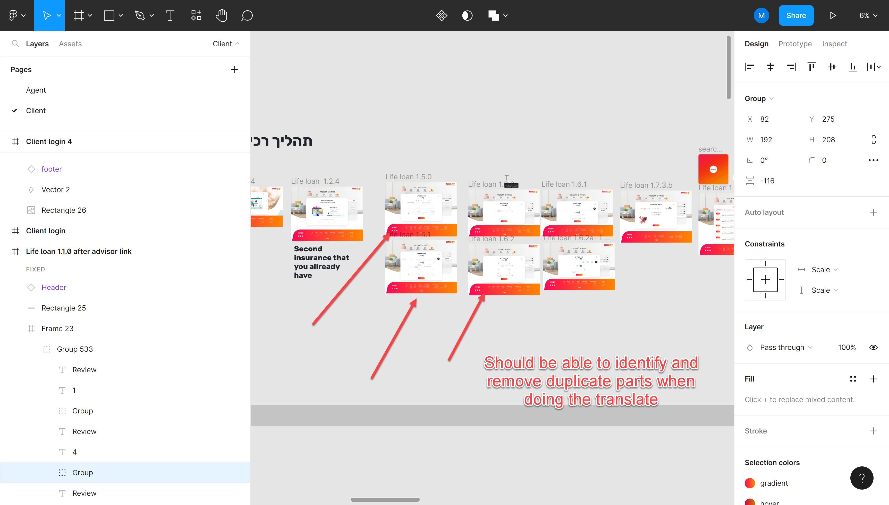
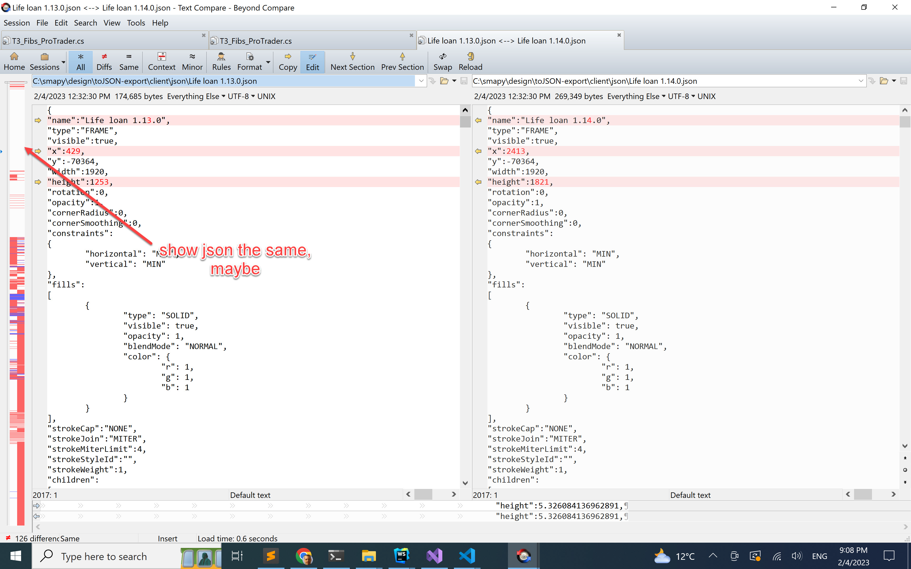
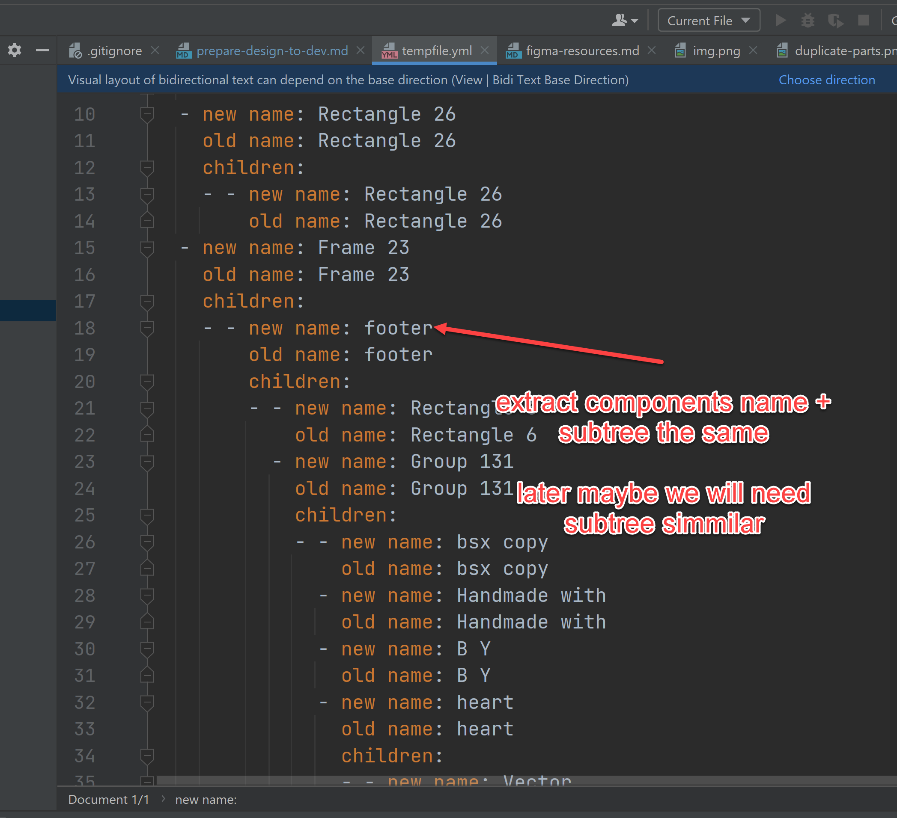
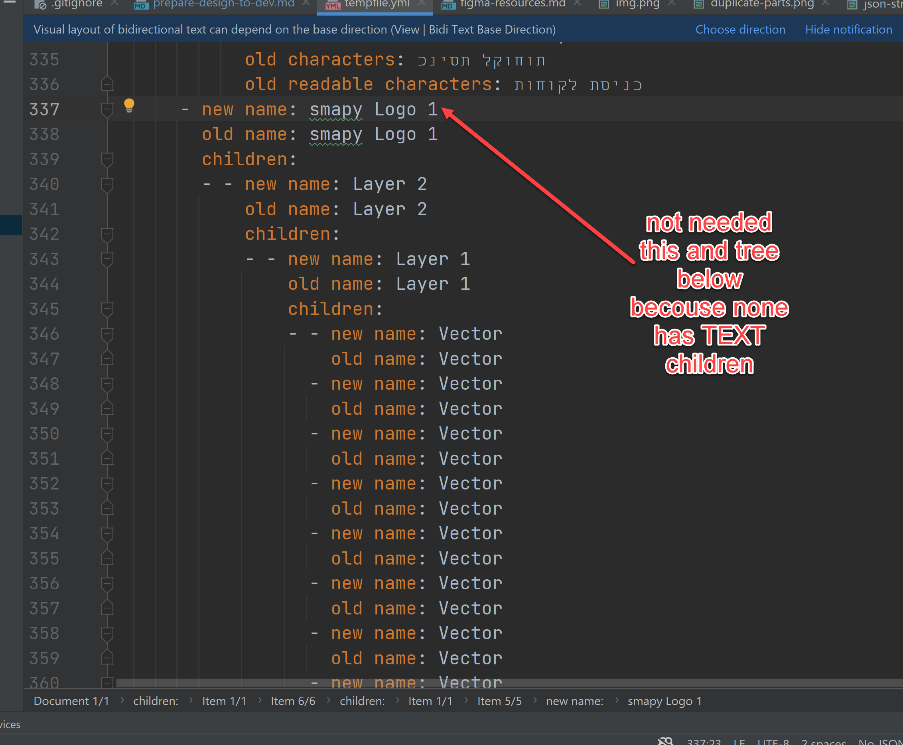

# Prepare Figma Design to Dev

## Figma Setup

- Download Figma for Windows  https://www.figma.com/downloads/
- Import design from [Drive](https://drive.google.com/file/d/1lomL9S70sjcSZALKDyakM6jcqg4_J9Ld/view?usp=sharing)
- Should look like that:

- Install toJSON plugin [toJSON](https://www.figma.com/community/plugin/1070707193730369068/toJSON) best to do it from Figma

- Export All screen (select all by drag and drop the area around the screens, not Ctrl-A) toJSON


- Already done for current version and can find here ./smapy/design/toJSON-export 

## Process JSON Files





Goal merge and transform all json files exported to one ./design/figma-translate.yaml while export only those parts


JSON structure is like:
```json
name:
children: [
        name:
        children: [
          name:
          type: TEXT
          characters: 
        ]     
]
```

Output YAML: `figma-mapping.yaml`
```yaml
NewPascalCaseName:
  old-name: old maybe hebrew name
  children:
    NewPascalCaseName2:
      old-name: old maybe hebrew name2
      children: 
        SomeTEXTNodeNewPascalCaseName:
          old-name: old hebrew name
          en: English translation of the text
          he: Orignal hebrew text
        MoreNodes:
          old-name: old node
        
```

Why YAML?, can start with JSON, but YAML less verbose I think and will be easier to edit, can experiment

## Avoid duplicate components

Next phase

Need to identify and ignore, reference duplicate parts, let's discuss this once you ready




    
## Apply the rename data to figma

Going to use ./design/figma-plugin-apply-changes 
self developed figma plugin to apply changes back to Figma, 
not written yet

## Notes

- Probably will have to redo the process several iteration to get correct names of all
- Design may change so will have to redo
- will use the he/en data to create translation file for the app
- will consider use the `figma-mapping.yaml` to create initial React code tree

# Iteration 2
- Extract common components and put it in the top level components->footer tree



- trim nodes, recursive up :) if there is no TEXT node in the children and name is generic like
  Rectangle, Vector, Layer {x}, Group {x}



